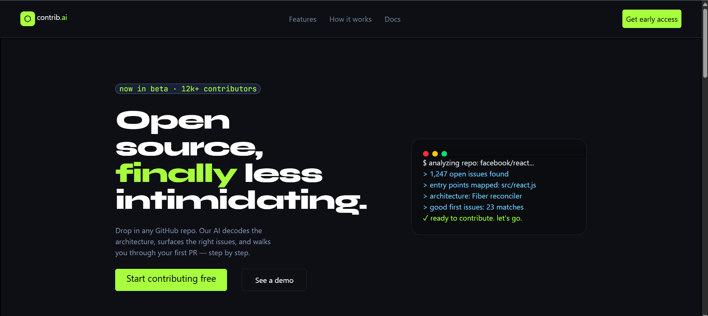
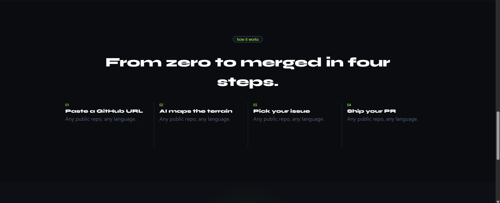
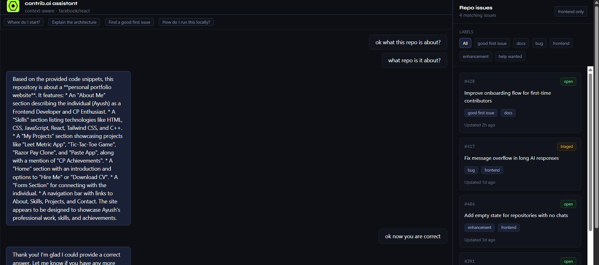

# contrib.ai

contrib.ai is a repo-aware assistant for open-source contributors. Paste a repository link, let the project process the codebase, and then ask questions about architecture, setup, contribution paths, and good first issues through a chat interface.

## Screenshots

Add your project screenshots to a `screenshots/` folder at the root of this repo, then update these image paths if needed.

### Landing Page



### Repository Link Flow



### Chatbot With Issues Panel



## Features

- Repository URL submission flow
- AI-powered chat interface for asking questions about a processed repo
- Conversation persistence by repository
- Real-time responses with Socket.IO
- Frontend issues panel with label filtering
- Dark, developer-focused UI built with React and Tailwind CSS
- Python AI engine for repository processing and semantic search

## Tech Stack

- Frontend: React, TypeScript, Vite, Tailwind CSS
- Backend: Node.js, Express, Socket.IO, MongoDB, Mongoose
- AI Engine: FastAPI, Google Gemini, PyMongo, Tree-sitter
- Database: MongoDB

## Project Structure

```text
.
|-- ai_engine/        # FastAPI service and repo processing/search logic
|-- client/           # React + Vite frontend
|-- server/           # Express API and Socket.IO server
|-- scripts/          # Utility scripts
`-- README.md
```

## Getting Started

### Prerequisites

- Node.js
- Python 3.10+
- MongoDB connection string
- Gemini API key

### Environment Variables

Create environment files as needed for the backend and AI engine.

```env
MONGO_URI=your_mongodb_connection_string
GEMINI_KEY=your_gemini_api_key
```

## Installation

Install frontend dependencies:

```bash
cd client
npm install
```

Install backend dependencies:

```bash
cd server
npm install
```

Install AI engine dependencies:

```bash
cd ai_engine
pip install -r requirement.txt
```

## Running Locally

Start the backend server:

```bash
cd server
npm run dev
```

Start the AI engine:

```bash
cd ai_engine
uvicorn main:app --reload
```

Start the frontend:

```bash
cd client
npm run dev
```

By default, the Express server runs on port `8080`, and Vite will print the frontend URL in the terminal.

## Available Scripts

Frontend:

```bash
npm run dev
npm run build
npm run lint
npm run preview
```

Backend:

```bash
npm run dev
npm start
```

## Notes

- The issues panel in the chatbot is currently frontend-only mock UI.
- Backend issue fetching and label syncing can be connected later through a GitHub API integration or a repository issue ingestion pipeline.
- The default `client/README.md` is the Vite template README; this root README is the main project documentation.
